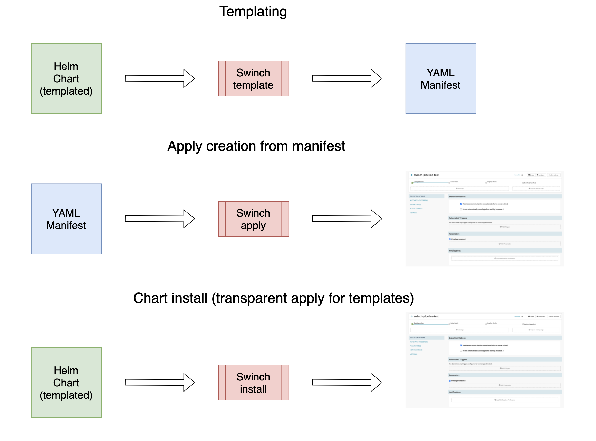

# Swinch


Manage your Spinnaker pipelines with Kubernetes manifest and objects.    
Swinch is a CLI tool that aims at functionality similar to kubectl and helm, but for Spinnaker.  

Our goal is to make using Spinnaker friendly for users already familiar with the Kubernetes way of deploying by provide the same language and format used for managing Kubernetes asset, but for Spinnaker. Create, delete, edit and manage your Spinnaker CD pipelines reliably, programmatically and sourced controlled, from Helm like templated charts, with built in support for dry-run, diff and validation.

## High Level Design

Swinch uses the Kubernetes manifest structure to define Spinnaker objects, and these manifest can be templated and structured like a Helm Chart.  
There are several ways to interact with manifest to manage Spinnaker applications and pipelines:

- generating manifests from the chart (`helm template` equivalent), and then running the apply command on the resulting manifests (`kubectl apply` equivalent)
- installing the chart with the default or a custom values.yaml file (`helm install` equivalent)



### Helm like chart and templating support:
```bash
swinch template -c samples/charts/application -o samples/manifests/application
```

Application Chart template:
  
```yaml
---
apiVersion: spinnaker.adobe.com/alpha1
kind: Application
metadata:
  name:  {{ .Values.application.name }}
spec:
  email: {{ .Values.application.email }}
  cloudProviders: ""
  permissions:
    EXECUTE:
      - {{ .Values.application.ldap }}
    READ:
      - {{ .Values.application.ldap }}
    WRITE:
      - {{ .Values.application.ldap }}
```

Values file:

```yaml
application:
  name: swinchuuidtest
  email: dcoman@adobe.com
  ldap: "add_spinnaker_team_ldap"
```

Output:

```yaml
---
apiVersion: spinnaker.adobe.com/alpha1
kind: Application
metadata:
  name:  swinchuuidtest
spec:
  email: dcoman@adobe.com
  cloudProviders: ""
  permissions:
    EXECUTE:
      - add_spinnaker_team_ldap
    READ:
      - add_spinnaker_team_ldap
    WRITE:
      - add_spinnaker_team_ldap
```

Some sample charts for pipelines are available as-well:

```bash
swinch template -c samples/charts/pipeline  -o samples/manifests/pipeline
```

## Basic usage

### Template and apply flow

Generate manifest from the Chart and apply the resulting manifests:

```bash
swinch template -c samples/charts/application -o samples/manifests/application 
swinch template -c samples/charts/pipeline  -o samples/manifests/pipeline
swinch apply -f samples/manifests/application
swinch apply -f samples/manifests/pipeline
```

### Install flow 

Directly install a Chart:

```bash
swinch install samples/charts/application 
swinch install samples/charts/pipeline 
```

### Shell completion
To get shell completion instructions for bash and zsh run:

```bash
swinch completion -h
```

### Usage

```bash
swinch help

Available Commands:
  apply       Apply or sync an Application or Pipeline from a manifest
  completion  Generate shell completion script
  config      Tweak swinch config
  delete      Delete the Application or Pipeline form a manifest
  help        Help about any command
  import      Import a chart from spinnaker
  install     Installs a swinch chart
  plan        Plan
  template    Generate manifests from chart domain
  uninstall   Uninstalls a swinch chart
  version     Print swinch version
```

## Dev setup

Install go for your [platform](https://golang.org/doc/install)  
Set up your GO env, example:  

```bash

SWINCH_REPO=git/swinch
export GOPATH=$HOME/go:$HOME/SWINCH_REPO
export GOBIN=$HOME/go/bin
export PATH=${PATH}:$GOBIN

```

Install swinch:

```bash
SWINCH_REPO=$HOME/git/swinch
go install
```

